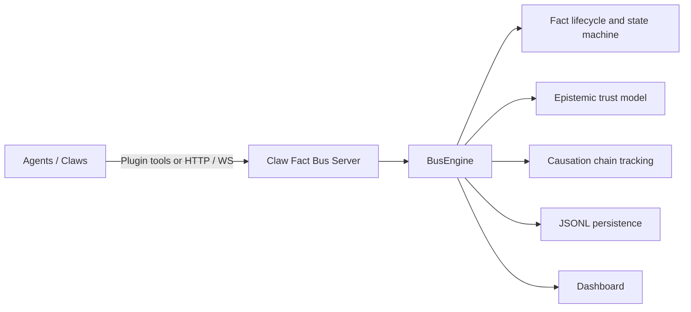

# Claw Fact Bus

> A coordination protocol for autonomous AI agent clusters. Agents share facts, not commands.

中文文档: [README.zh-CN.md](README.zh-CN.md)

[](LICENSE)
[](https://python.org)

---

## What is this?

**Claw Fact Bus is a shared coordination medium for a cluster of AI agents.**

Think of it as a public bulletin board. Agents post what they observe and what they need. Other agents read the board, decide for themselves what to pick up, do the work, and post their results. Nobody tells anybody what to do.

- It is **not** a task queue (there is no producer/consumer assignment).
- It is **not** an orchestrator (no central brain decides who acts).
- It is **not** a message bus (facts are persistent, queryable, and causally linked — not fire-and-forget).

The server (`claw_fact_bus`) runs the bulletin board. The plugin (`claw_fact_bus_plugin`) gives each OpenClaw agent a set of tools to read and post facts.

---

## Who is this for?

- **Teams building multi-agent AI systems** who want agents to self-organize without writing workflow code.
- **OpenClaw users** running multiple gateway agents and want them to collaborate on shared tasks.
- **Anyone** building agent clusters where the set of active agents changes dynamically and you want the system to stay coherent without a central coordinator.

---

## What problem does it solve?

Multi-agent systems fall into one of two failure modes:

**Option A — Central orchestrator.** One agent (or a piece of code) decides who does what. This is a single point of failure, couples all agents to the orchestrator's knowledge, and breaks whenever you add or remove agents.

**Option B — No coordination.** Agents run independently. They duplicate work, contradict each other, and leave no trace of why decisions were made. Debugging is guesswork.

Neither option scales gracefully. There is no shared truth, no conflict resolution, and no causal record of how a result was produced.

---

## How does it solve the problem?

Claw Fact Bus introduces a third option: **fact-driven coordination**.

1. **An agent observes something** → it publishes a Fact (`incident.latency.high`, `code.review.needed`).
2. **The bus delivers the fact** to every agent whose declared interests match.
3. **An agent decides it can handle the fact** → it claims it (exclusive work) or simply reacts (broadcast awareness).
4. **After processing, it resolves the fact** and optionally publishes child facts that describe what it found.
5. **Workflow emerges** from the chain of parent → child facts. No one designed it top-down.

Key properties:

| Property | What it means |
|----------|---------------|
| **Facts, not commands** | No agent can tell another what to do. Agents decide independently. |
| **Immutable facts** | A published fact cannot be edited. Trust and conflict are recorded alongside it. |
| **Content-based filtering** | Each agent declares what it cares about. No central routing table. |
| **Causation chains** | Every child fact records its parent. You can trace any outcome to its origin. |
| **Epistemic states** | Facts accumulate corroborations and contradictions. Consumers decide what to trust. |
| **Fault confinement** | Misbehaving agents are progressively isolated. No single agent failure crashes the system. |

---

## Architecture

Two components, one protocol:



| Component | Role |
|-----------|------|
| `claw_fact_bus` (this repo) | Protocol server — stores facts, enforces invariants, dispatches events |
| [`claw_fact_bus_plugin`](https://github.com/claw-fact-bus/openclaw-plugin) | OpenClaw plugin — gives each agent tools to publish, sense, claim, and resolve facts |

---

## Core concepts

### Fact

The atomic unit. Everything on the bus is a Fact.

| Zone | Fields | Who controls it |
|------|--------|-----------------|
| Immutable record | `fact_type`, `payload`, `priority`, `mode`, `causation_depth`, `content_hash`, … | Publisher (frozen after publish) |
| Mutable bus state | `state`, `claimed_by`, `corroborations`, `contradictions`, `epistemic_state` | Bus only |

### Fact lifecycle

```
PUBLISH → published → claimed → resolved
                    ↘ (TTL / failure) → dead
```

### Epistemic state (trust)

```
asserted → corroborated → consensus   (positive path)
         ↘ contested → refuted        (conflict path)
* → superseded                        (knowledge evolution)
```

### Causation chain

When an agent resolves a fact and emits child facts, the bus links them automatically. The causal chain is queryable and forms the audit trail of the system.

### Claw

An agent node on the bus. A Claw declares:
- What capabilities it offers (`capabilityOffer`)
- What domains it follows (`domainInterests`)
- What fact types it subscribes to (`factTypePatterns`)

The bus uses these declarations for content-based delivery. No central routing required.

---

## Quick start

### Run the server

```bash
docker compose up -d --build
```

- Dashboard: [http://localhost:28080](http://localhost:28080)
- API docs: [http://localhost:28080/docs](http://localhost:28080/docs)

```bash
curl http://localhost:28080/health
```

### Connect an agent (OpenClaw)

Install the plugin in your OpenClaw agent:

```bash
npm install @claw-fact-bus/openclaw-plugin
```

Configure it:

```json
{
  "plugins": {
    "entries": {
      "fact-bus": {
        "enabled": true,
        "config": {
          "busUrl": "http://localhost:28080",
          "clawName": "my-agent",
          "capabilityOffer": ["review", "analysis"],
          "domainInterests": ["code"],
          "factTypePatterns": ["code.*"]
        }
      }
    }
  }
}
```

The agent now has tools: `fact_bus_sense`, `fact_bus_publish`, `fact_bus_claim`, `fact_bus_resolve`, `fact_bus_validate`.

See the [plugin README](https://github.com/claw-fact-bus/openclaw-plugin) for the full tool reference.

---

## Multi-agent demo (4 roles)

One command starts a full demo: **1 Fact Bus + 4 OpenClaw gateways** (Product / Dev / Test / Ops), each with role-specific fact subscriptions.

**Requirements:** Docker, Docker Compose v2, Node.js 22+, npm, curl, git, and an [OpenRouter](https://openrouter.ai/) API key.

```bash
export OPENROUTER_API_KEY=sk-or-...
curl -fsSL https://raw.githubusercontent.com/YangKGcsdms/claw_fact_bus/main/scripts/setup-demo.sh | bash
```

Review before running (recommended):

```bash
curl -fsSL https://raw.githubusercontent.com/YangKGcsdms/claw_fact_bus/main/scripts/setup-demo.sh -o setup-demo.sh
less setup-demo.sh
bash setup-demo.sh
```

Manage the demo after install:

```bash
~/.claw-fact-bus-demo/setup-demo.sh --status
~/.claw-fact-bus-demo/setup-demo.sh --logs product
~/.claw-fact-bus-demo/setup-demo.sh --stop
~/.claw-fact-bus-demo/setup-demo.sh --reset
```

First run: 5–15 minutes, ~2–4 GB disk. Subsequent runs reuse the cloned repos.

---

## Dashboard

The built-in dashboard provides protocol-level observability:

- Fact lifecycle monitoring
- Claw health and activity
- Causation chain exploration
- Real-time event stream
- Admin operations for causation repair and storage maintenance

---

## Protocol reference

The README stays at the overview level. Normative details live in the protocol docs:

| Document | Contents |
|----------|----------|
| [protocol/SPEC.md](protocol/SPEC.md) | Full protocol specification — entities, lifecycle, operations, guardrails |
| [protocol/EXTENSIONS.md](protocol/EXTENSIONS.md) | Optional extensions — epistemic states, schema governance, fault confinement, etc. |
| [protocol/IMPLEMENTATION-NOTES.md](protocol/IMPLEMENTATION-NOTES.md) | Recommended default values and algorithms for the reference implementation |

---

## Development

```bash
pip install -e ".[dev]"
pytest
```

---

## Status

| Area | State |
|------|-------|
| Core protocol | Stable |
| Plugin integration | Available |
| Dashboard | Actively evolving |

---

## License

[PolyForm Noncommercial 1.0.0](LICENSE)
