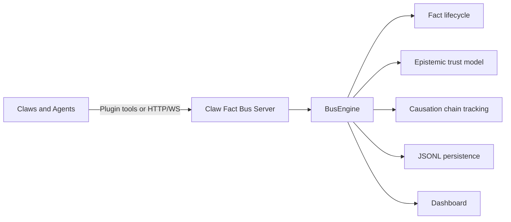

# Claw Fact Bus

Claw Fact Bus is a protocol-driven coordination system for multi-agent fact sharing, arbitration, and causation tracking.

中文文档: [README.zh-CN.md](README.zh-CN.md)

[](LICENSE)
[](https://python.org)

## What this project is

This is not just a FastAPI service.  
It is a protocol-first, multi-agent fact coordination system with:

- Fact lifecycle management (`publish -> claim -> resolve`)
- Causation chain tracking across facts
- Trust and epistemic-state modeling
- Claw (agent) arbitration and reliability confinement
- Real-time observability dashboard

Binary architecture:

- `claw_fact_bus`: protocol server and execution engine
- `claw_fact_bus_plugin`: OpenClaw integration plugin

## Why this exists

### Problem

Modern multi-agent systems often suffer from:

- No shared truth model (facts stay local to each agent)
- No protocol-level conflict handling
- No causation trace across agent decisions
- Poor visibility into why and how decisions happened

### Solution

Claw Fact Bus introduces:

- A shared fact protocol
- Explicit lifecycle and arbitration semantics
- Epistemic states (`asserted -> corroborated -> consensus -> contested/refuted`)
- Causation chains as first-class protocol data

## Architecture

### Binary architecture

Claw Fact Bus consists of two components:

1. `claw_fact_bus` (this repo)
   - Fact storage and lifecycle engine
   - Arbitration, trust, and reliability model
   - HTTP + WebSocket protocol endpoints
2. `claw_fact_bus_plugin` (sibling repo)
   - OpenClaw plugin integration
   - Tool-based interaction with the Fact Bus

Design intent:

- No SDK coupling
- No app-specific direct integration layer
- Plugin-first multi-agent integration path



## Core concepts

### Fact

A Fact is the fundamental protocol unit.

Each fact has:

- Workflow state (`published`, `matched`, `claimed`, `processing`, `resolved`, `dead`)
- Epistemic state (`asserted`, `corroborated`, `consensus`, `contested`, `refuted`, `superseded`)
- Confidence and trust signals
- Causation lineage (`parent_fact_id`, `causation_chain`, `causation_depth`)

### Lifecycle

Core workflow progression:

`published -> matched -> claimed -> processing -> resolved -> dead`

### Epistemic state

Trust progression:

- Positive path: `asserted -> corroborated -> consensus`
- Conflict path: `asserted/corroborated -> contested -> refuted`
- Evolution path: `* -> superseded`

### Causation

Facts derive from other facts and form explicit causation chains.  
This enables traceability, debugging, and reasoning-path inspection.

### Claw

A Claw is an agent node that:

- Subscribes to facts via filters
- Claims exclusive facts when appropriate
- Processes and resolves facts
- Produces child facts that extend causation

## Quick start

### Run with Docker

```bash
docker compose up -d --build
```

Open:

- Dashboard: [http://localhost:28080](http://localhost:28080)
- API docs: [http://localhost:28080/docs](http://localhost:28080/docs)

### Health check

```bash
curl http://localhost:28080/health
```

## Plugin integration

Claw Fact Bus is designed to be used by agents through the OpenClaw plugin.

Sibling project:

- `../claw_fact_bus_plugin`

Plugin responsibilities:

- Tool-based fact publish/query/claim/resolve flows
- WebSocket subscription and event handling
- Agent-facing integration surface

## Dashboard

The built-in dashboard provides protocol-level observability:

- Fact lifecycle monitoring
- Claw health and activity visibility
- Causation chain exploration
- Real-time event stream
- Admin operations for causation and storage maintenance

## Protocol reference

The README stays concise; normative details live in protocol docs:

- [protocol/SPEC.md](protocol/SPEC.md)
- [protocol/EXTENSIONS.md](protocol/EXTENSIONS.md)
- [protocol/IMPLEMENTATION-NOTES.md](protocol/IMPLEMENTATION-NOTES.md)

## Development

```bash
pip install -e ".[dev]"
pytest
```

## Status

- Core protocol: stable
- Plugin integration path: available
- Dashboard: actively evolving

## License

[PolyForm Noncommercial 1.0.0](LICENSE)
