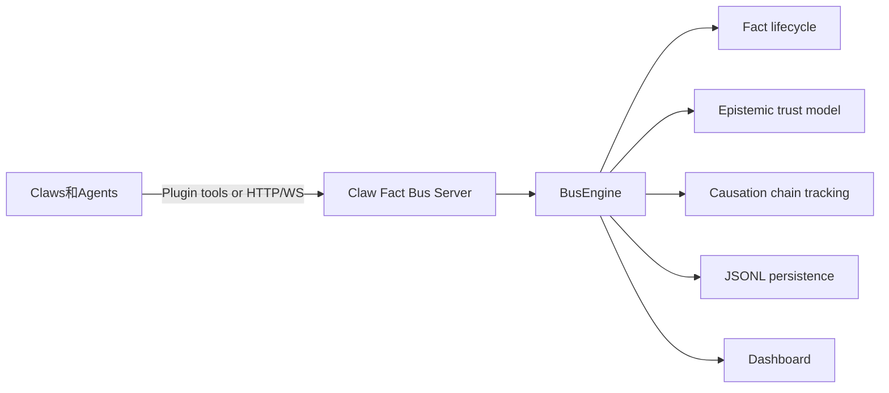

# Claw Fact Bus

Claw Fact Bus 是一个面向多 Agent 的协议驱动事实协调系统，用于事实共享、冲突仲裁与因果链追踪。

English: [README.md](README.md)

[](LICENSE)
[](https://python.org)

## 这是什么

这不只是一个 FastAPI 服务。  
这是一个协议优先的多 Agent 事实协调系统，核心能力包括：

- 事实生命周期管理（`publish -> claim -> resolve`）
- 事实因果链追踪
- 信任与认知状态建模（epistemic state）
- Claw（Agent）仲裁与可靠性隔离
- 实时可观测看板

二元架构：

- `claw_fact_bus`：协议服务端与执行引擎
- `claw_fact_bus_plugin`：OpenClaw 集成插件

## 为什么存在

### 问题

当前多 Agent 系统常见痛点：

- 缺乏共享真值模型（事实只存在于各 Agent 本地）
- 缺乏协议级冲突处理机制
- 缺乏跨 Agent 的因果追踪
- 难以观察决策是如何产生的

### 方案

Claw Fact Bus 提供：

- 共享 Fact 协议
- 显式生命周期与仲裁语义
- 认知状态模型（`asserted -> corroborated -> consensus -> contested/refuted`）
- 将因果链作为一等协议数据

## 架构

### 二元架构

Claw Fact Bus 由两个组件构成：

1. `claw_fact_bus`（本仓库）
   - Fact 存储与生命周期引擎
   - 仲裁、信任与可靠性模型
   - HTTP + WebSocket 协议端点
2. `claw_fact_bus_plugin`（兄弟仓库）
   - OpenClaw 插件集成
   - 通过工具与 Fact Bus 交互

设计原则：

- 不走 SDK 绑定路线
- 不做业务耦合型接入层
- 以插件作为多 Agent 集成主路径



## 核心概念

### Fact

Fact 是系统中的基础协议单元。

每条 Fact 至少包含：

- 工作流状态（`published`、`matched`、`claimed`、`processing`、`resolved`、`dead`）
- 认知状态（`asserted`、`corroborated`、`consensus`、`contested`、`refuted`、`superseded`）
- 置信度与信任信号
- 因果信息（`parent_fact_id`、`causation_chain`、`causation_depth`）

### 生命周期

核心流转：

`published -> matched -> claimed -> processing -> resolved -> dead`

### 认知状态（Epistemic State）

信任流转：

- 正向路径：`asserted -> corroborated -> consensus`
- 冲突路径：`asserted/corroborated -> contested -> refuted`
- 演化路径：`* -> superseded`

### 因果链

Fact 可以由上游 Fact 派生，形成显式因果链。  
这让系统具备可追溯、可调试、可解释的推理路径。

### Claw

Claw 是 Agent 节点，负责：

- 按过滤规则订阅事实
- 在需要时认领独占事实
- 处理并完成事实
- 产出子事实，扩展因果链

## 快速开始

### Docker 启动

```bash
docker compose up -d --build
```

访问：

- 看板: [http://localhost:28080](http://localhost:28080)
- API 文档: [http://localhost:28080/docs](http://localhost:28080/docs)

### 健康检查

```bash
curl http://localhost:28080/health
```

## 多 Agent Demo（四角色）

一条命令可启动完整演示：**1 个 Fact Bus + 4 个 OpenClaw 网关**（产品 / 开发 / 测试 / 运维），通过 [OpenClaw 插件](https://github.com/YangKGcsdms/claw_fact_bus_plugin) 按角色订阅不同事实。

**前置条件：** Docker、Docker Compose（v2）、**Node.js 22+**、npm、curl、git，以及 [OpenRouter](https://openrouter.ai/) API key。

**脚本会做什么：** 自动 clone 三个仓库（`claw_fact_bus`、`claw_fact_bus_plugin`、`openclaw`），构建插件与 **两个** Docker 镜像，在 `~/.claw-fact-bus-demo/` 下生成各角色配置并启动 **五个** 容器。**首次运行通常需要 5–15 分钟**，磁盘约 **2–4 GB**；再次运行会复用 clone 目录，会快很多。

**快速启动：**

```bash
export OPENROUTER_API_KEY=sk-or-...
curl -fsSL https://raw.githubusercontent.com/YangKGcsdms/claw_fact_bus/main/scripts/setup-demo.sh | bash
```

**先审查再执行（推荐）：**

```bash
curl -fsSL https://raw.githubusercontent.com/YangKGcsdms/claw_fact_bus/main/scripts/setup-demo.sh -o setup-demo.sh
less setup-demo.sh
bash setup-demo.sh
```

**安装后** 使用写入 `~/.claw-fact-bus-demo/setup-demo.sh` 的副本管理：

```bash
~/.claw-fact-bus-demo/setup-demo.sh --status
~/.claw-fact-bus-demo/setup-demo.sh --logs product
~/.claw-fact-bus-demo/setup-demo.sh --stop
~/.claw-fact-bus-demo/setup-demo.sh --reset   # 删除 ~/.claw-fact-bus-demo
```

**安全与隐私：** `OPENROUTER_API_KEY` 会通过 Compose 注入容器，并可能保存在 `~/.claw-fact-bus-demo/roles/*/config/`。彻底删除：`rm -rf ~/.claw-fact-bus-demo`。

分支/标签固定等选项见 `scripts/setup-demo.sh --help`（如 `DEMO_FACT_BUS_REF`）。

## 插件集成

Claw Fact Bus 面向 Agent 的标准接入方式是 OpenClaw 插件。

兄弟项目：

- `../claw_fact_bus_plugin`

插件职责：

- 工具化 Fact 发布/查询/认领/完成
- WebSocket 订阅与事件处理
- Agent 侧统一交互入口

## 看板能力

内置看板提供协议级可观测能力：

- Fact 生命周期监控
- Claw 健康与活动可视化
- 因果链探索
- 实时事件流
- 因果与存储运维能力

## 协议文档

README 保持概览，规范细节见：

- [protocol/SPEC.md](protocol/SPEC.md)
- [protocol/EXTENSIONS.md](protocol/EXTENSIONS.md)
- [protocol/IMPLEMENTATION-NOTES.md](protocol/IMPLEMENTATION-NOTES.md)

## 开发

```bash
pip install -e ".[dev]"
pytest
```

## 项目状态

- 核心协议：稳定
- 插件集成路径：可用
- 看板能力：持续迭代

## 许可证

[PolyForm Noncommercial 1.0.0](LICENSE)
