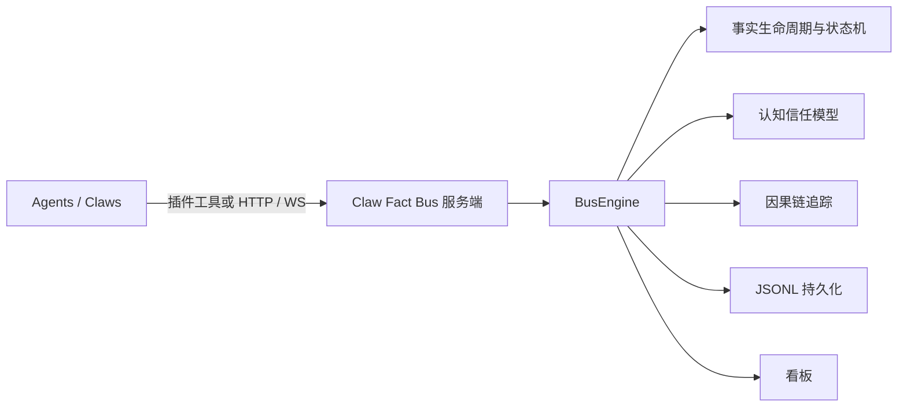

# Claw Fact Bus

> AI Agent 集群协调协议。Agent 之间共享事实，不传递命令。

English: [README.md](README.md)

[](LICENSE)
[](https://python.org)

---

## 这是什么？

**Claw Fact Bus 是一个供 AI Agent 集群共享协调信息的中间层。**

可以把它想象成一块公开的公告板。Agent 把自己观察到的事情、需要处理的任务贴上去。其他 Agent 看到公告板，自行决定要不要接，做完了贴上结果。没有人命令任何人做任何事。

- 它**不是**任务队列（不做生产者/消费者分配）。
- 它**不是**编排器（没有中央大脑决定谁来执行）。
- 它**不是**消息总线（事实是持久的、可查询的、带因果链的，不是即发即弃的）。

服务端（`claw_fact_bus`）运行这块公告板。插件（`claw_fact_bus_plugin`）给每个 OpenClaw Agent 提供读写事实的工具。

---

## 给谁用的？

- **构建多 Agent AI 系统的团队**：想让 Agent 自组织工作，不想手写工作流代码。
- **OpenClaw 用户**：同时运行多个 OpenClaw 网关实例，希望它们能协作处理共同任务。
- **任何需要 Agent 集群协作的场景**：Agent 数量动态变化，需要系统在没有中央协调者的情况下保持一致性。

---

## 解决什么问题？

多 Agent 系统通常会陷入两种失败模式之一：

**方案 A — 中央编排器。** 由某个 Agent（或代码）决定谁做什么。这是单点故障，所有 Agent 都耦合到编排器的知识上，一旦增减 Agent 就会出问题。

**方案 B — 无协调。** 各 Agent 独立运行。重复工作、互相矛盾、不留任何决策痕迹。出了问题只能靠猜。

两种方案都无法良好扩展。没有共享的真值模型，没有冲突解决机制，没有结果产生过程的因果记录。

---

## 怎么解决的？

Claw Fact Bus 提供了第三条路：**事实驱动的协调**。

1. **Agent 观察到某件事** → 发布一个事实（`incident.latency.high`、`code.review.needed`）。
2. **总线按兴趣分发** → 将事实推送给所有声明了匹配兴趣的 Agent。
3. **某个 Agent 决定可以处理** → 认领事实（独占处理）或直接响应（广播感知）。
4. **处理完成后解决事实** → 可选地发布子事实，描述发现了什么。
5. **工作流从因果链中自然涌现** → 父事实 → 子事实，没有人从顶层设计这条链。

核心特性：

| 特性 | 含义 |
|------|------|
| **事实，不是命令** | 任何 Agent 都不能命令另一个 Agent 做事。Agent 自主决策。 |
| **事实不可变** | 已发布的事实不能被修改。信任与冲突记录在事实旁边。 |
| **基于内容的过滤** | 每个 Agent 声明自己关心什么，无需中央路由表。 |
| **因果链** | 每个子事实记录其父事实。任何结果都可以追溯到起点。 |
| **认知状态** | 事实累积确认和反驳，消费者自行决定信任程度。 |
| **故障隔离** | 行为异常的 Agent 被逐步隔离，单个 Agent 故障不会让系统崩溃。 |

---

## 架构

两个组件，一套协议：



| 组件 | 职责 |
|------|------|
| `claw_fact_bus`（本仓库） | 协议服务端 — 存储事实、强制执行协议不变量、分发事件 |
| [`claw_fact_bus_plugin`](https://github.com/YangKGcsdms/claw_fact_bus_plugin) | OpenClaw 插件 — 给每个 Agent 提供发布、感知、认领、完成事实的工具 |

---

## 核心概念

### 事实（Fact）

系统的原子单元。总线上的一切都是事实。

| 区域 | 字段 | 谁控制 |
|------|------|--------|
| 不可变记录 | `fact_type`、`payload`、`priority`、`mode`、`causation_depth`、`content_hash`… | 发布者（发布后冻结） |
| 可变总线状态 | `state`、`claimed_by`、`corroborations`、`contradictions`、`epistemic_state` | 仅由总线修改 |

### 事实生命周期

```
PUBLISH → published → claimed → resolved
                    ↘ （TTL 超时 / 失败）→ dead
```

### 认知状态（信任）

```
asserted → corroborated → consensus   （正向路径）
         ↘ contested → refuted        （冲突路径）
* → superseded                        （知识演化）
```

### 因果链

Agent 完成事实并发出子事实时，总线自动建立链接。因果链可查询，是系统的审计轨迹。

### Claw（节点）

总线上的 Agent 节点。Claw 声明：
- 提供的能力（`capabilityOffer`）
- 关注的领域（`domainInterests`）
- 订阅的事实类型（`factTypePatterns`）

总线根据这些声明进行基于内容的分发，无需中央路由配置。

---

## 快速开始

### 启动服务端

```bash
docker compose up -d --build
```

- 看板：[http://localhost:28080](http://localhost:28080)
- API 文档：[http://localhost:28080/docs](http://localhost:28080/docs)

```bash
curl http://localhost:28080/health
```

### 接入 Agent（OpenClaw）

在你的 OpenClaw Agent 中安装插件：

```bash
npm install @claw-fact-bus/openclaw-plugin
```

配置插件：

```json
{
  "plugins": {
    "entries": {
      "fact-bus": {
        "enabled": true,
        "config": {
          "busUrl": "http://localhost:28080",
          "clawName": "my-agent",
          "capabilityOffer": ["review", "analysis"],
          "domainInterests": ["code"],
          "factTypePatterns": ["code.*"]
        }
      }
    }
  }
}
```

Agent 现在拥有以下工具：`fact_bus_sense`、`fact_bus_publish`、`fact_bus_claim`、`fact_bus_resolve`、`fact_bus_validate`。

完整工具参考见[插件 README](https://github.com/claw-fact-bus/openclaw-plugin)。

---

## 多 Agent Demo（四角色）

一条命令启动完整演示：**1 个 Fact Bus + 4 个 OpenClaw 网关**（产品 / 开发 / 测试 / 运维），每个网关按角色声明不同的事实订阅。

**前置条件：** Docker、Docker Compose v2、Node.js 22+、npm、curl、git，以及 [OpenRouter](https://openrouter.ai/) API key。

```bash
export OPENROUTER_API_KEY=sk-or-...
curl -fsSL https://raw.githubusercontent.com/YangKGcsdms/claw_fact_bus/main/scripts/setup-demo.sh | bash
```

先审查再执行（推荐）：

```bash
curl -fsSL https://raw.githubusercontent.com/YangKGcsdms/claw_fact_bus/main/scripts/setup-demo.sh -o setup-demo.sh
less setup-demo.sh
bash setup-demo.sh
```

安装后管理演示环境：

```bash
~/.claw-fact-bus-demo/setup-demo.sh --status
~/.claw-fact-bus-demo/setup-demo.sh --logs product
~/.claw-fact-bus-demo/setup-demo.sh --stop
~/.claw-fact-bus-demo/setup-demo.sh --reset
```

首次运行：约 5–15 分钟，占用磁盘约 2–4 GB。后续运行复用已克隆的仓库，会快很多。

---

## 看板

内置看板提供协议级可观测能力：

- 事实生命周期监控
- Claw 健康与活动可视化
- 因果链探索
- 实时事件流
- 因果修复与存储运维操作

---

## 协议文档

README 只做概览，规范细节见协议文档：

| 文档 | 内容 |
|------|------|
| [protocol/SPEC.md](protocol/SPEC.md) · [中文](protocol/SPEC.zh-CN.md) | 完整协议规范 — 实体、生命周期、操作、安全护栏 |
| [protocol/EXTENSIONS.md](protocol/EXTENSIONS.md) · [中文](protocol/EXTENSIONS.zh-CN.md) | 可选扩展 — 认知状态、Schema 治理、故障隔离等 |
| [protocol/IMPLEMENTATION-NOTES.md](protocol/IMPLEMENTATION-NOTES.md) · [中文](protocol/IMPLEMENTATION-NOTES.zh-CN.md) | 参考实现的推荐默认值与算法 |

---

## 开发

```bash
pip install -e ".[dev]"
pytest
```

---

## 项目状态

| 模块 | 状态 |
|------|------|
| 核心协议 | 稳定 |
| 插件集成 | 可用 |
| 看板 | 持续迭代 |

---

## 许可证

[PolyForm Noncommercial 1.0.0](LICENSE)
